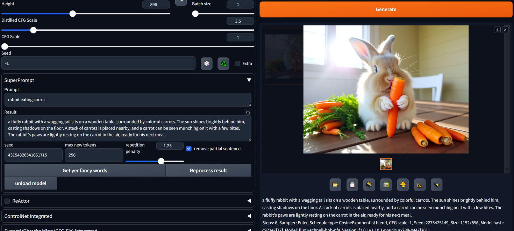

# SuperPrompter #
### extension for Forge and A1111 webUIs for Stable Diffusion ###

#### initially based on https://github.com/NeuralSamurAI/Comfyui-Superprompt-Unofficial/ ####
There are some other webui extensions that do the same thing, but I didn't see them until after I'd spent 15 minutes on this.

uses model from [BrianFitzgerald](https://huggingface.co/roborovski/superprompt-v1)
article [here](https://brianfitzgerald.xyz/prompt-augmentation)

---
## Install ##
in your webUI, go to **Extensions** tab, then **Install from URL**, use URL for this repo.

---
## Basic usage ##
Enter your lazy and boring prompt in the box, click go button. Receive probably incoherent ramblings, which often generate good images. Sometimes you'll get a grammatical reasonable result, which will generate an equally good image.

Good as way to expand prompts, spark imagination and develop them into something special. Or just a bit of fun.

---
## Advanced / Details ##
lol

Changing seed does change results.
Repetition penalty should reduce the model repeating itself.
Remove partial sentences cleans the result, sometimes.
Reprocess grabs the result and uses it as source for another iteration.
Model + tokenizer downloaded and saved locally on first use.
Model + tokenizer stays loaded, unless you hit the 'unload model' button. Reclaim that 293MB. Note that the model is deleted, but I don't call garbage collection.
If using Windows, you could use CoPilot to rewrite the output. Typically improves lanaguage quality and coherency.

---
The seed used changes the seed used by torch. So if you hit the go button at exactly the ~~right~~wrong time, you'll maybe get a generation that you'll never be able to repeat.

### To do, maybe: ###
button to get prompt from main Prompt textbox
button to send result to main Prompt textbox
